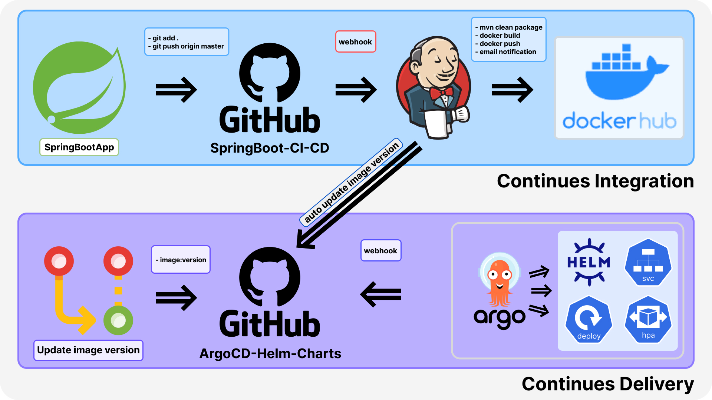

# SpringBoot CI/CD with Jenkins and Argo CD on Amazon EKS

This project demonstrates a CI/CD pipeline using Spring Boot application, Jenkins, Docker/Dockerhub, Helm, and Argo CD on Kubernetes running on Amazon EKS.

## Preview

## Technologies Used

- **Spring Boot:** Open-source Java-based framework for creating microservices and Java applications.
- **Jenkins:** Open-source automation server for automating software development processes.
- **Docker:** Platform for developing, shipping, and running applications in containers.
- **DockerHub:** Cloud-based repository for Docker container images.
- **Argo CD:** Declarative, GitOps continuous delivery tool for Kubernetes.
- **Helm:** Kubernetes package manager for deploying applications and services.
- **Kubernetes:** Open-source container-orchestration system.
- **Amazon EKS:** Managed Kubernetes service on AWS.

## Part 1: SpringBoot CI

This part focuses on Continuous Integration using Jenkins and Docker.

### Steps Involved:

1. **SpringBoot App Development:**
   - Develop Spring Boot application locally.

2. **Push to GitHub:**
   - Push changes to GitHub repository ([SpringBoot-CI-CD](https://github.com/ValeriiVasianovych/SpringBoot-CI-CD)).

3. **Jenkins Pipeline:**
   - Configure Jenkins to monitor the GitHub repository.
   - On `git push` to `master`, Jenkins performs:
     - Checks out the latest code.
     - Builds with Maven (`mvn clean package`).
     - Builds Docker image.
     - Pushes Docker image to DockerHub.
     - Sends email notification on success.

## Part 2: SpringBoot GitOps CD

This part focuses on Continuous Deployment using Argo CD and Helm Charts on Amazon EKS.

### Steps Involved:

1. **Deployment Repository Setup:**
   - Use separate GitHub repository ([ArgoCD-Helm-Charts](https://github.com/ValeriiVasianovych/ArgoCD-Helm-Charts)) for Argo CD Helm Charts.

2. **Argo CD Configuration:**
   - Configure Argo CD on EKS cluster.
   - Argo CD monitors Helm Charts repository.

3. **Continuous Deployment:**
   - Argo CD detects new image version in Helm Charts.
   - Deploys updated application to EKS cluster automatically.

### Repository Links:

- **SpringBoot App Repository:**
  - Repository: [SpringBoot-CI-CD](https://github.com/ValeriiVasianovych/SpringBoot-CI-CD)

- **Argo CD Helm Charts Repository:**
  - Repository: [ArgoCD-Helm-Charts](https://github.com/ValeriiVasianovych/ArgoCD-Helm-Charts)

### License:

This project is licensed under the MIT License - see the [LICENSE](LICENSE) file for details.
